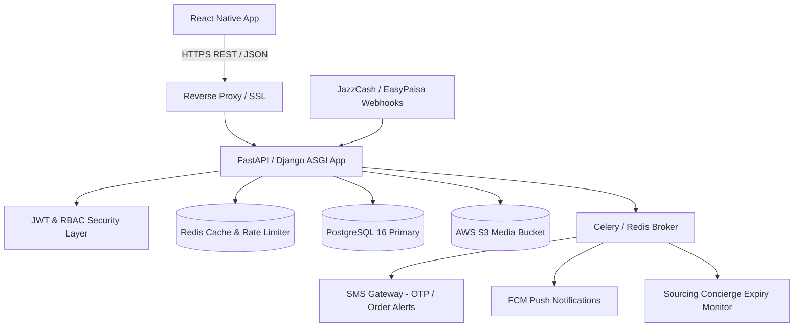
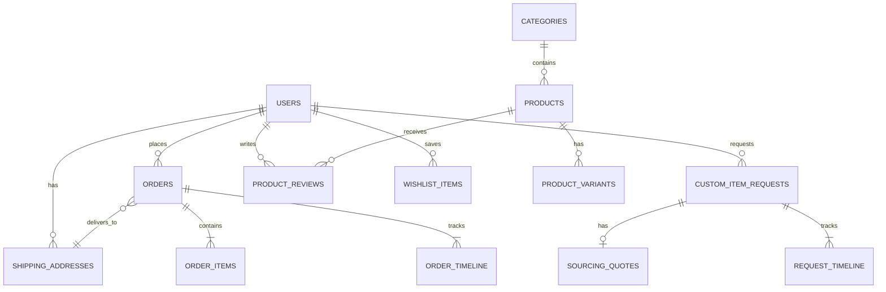

# BAZAURA.PK - Complete Python Backend Architecture & API Specification

> **Target Audience:** Python Backend Developer (FastAPI / Django REST Framework)  
> **Platform:** Bazaura.pk Mobile (React Native - iOS & Android)  
> **Primary Database:** PostgreSQL 16+ (with SQLAlchemy 2.0 or Django ORM)  
> **Cache & Message Broker:** Redis 7+  
> **Task Queue:** Celery / ARQ (for asynchronous tasks, SMS, emails, push notifications, and sourcing quote timeouts)  
> **Storage:** AWS S3 or MinIO (compatible object storage for catalog & user uploads)  
> **Document Version:** 1.0.0 Production Blueprint  

---

## 1. System Architecture Overview

### 1.1 What Bazaura.pk Does
Bazaura.pk is a premier Pakistani quick-commerce and managed marketplace mobile application. It features:
1. **⚡ 2-Hour Express Lahore Delivery:** Hyperlocal instant fulfillment within Lahore (served via centralized/local hubs like Gulberg, DHA, Johar Town).
2. **📦 2-3 Days Nationwide Delivery:** Pakistan-wide standard courier fulfillment across Karachi, Islamabad, Rawalpindi, Faisalabad, Multan, and other cities.
3. **✨ Bazaura Sourcing Concierge ("Request Item"):** A unique feature allowing users to submit custom requests for unlisted or rare products (electronics, perfume, gaming gear, luxury goods). Sourcing agents source the item, quote a price within minutes, and deliver in 2 Hours (Lahore) or Nationwide upon user confirmation.
4. **💰 Omnichannel Checkout:** Cash on Delivery (COD), JazzCash, EasyPaisa, and Debit/Credit Cards in PKR.

### 1.2 Data Flow Diagram


---

## 2. Database Models & Schema Requirements (PostgreSQL)

All monetary amounts (`price`, `subtotal`, `delivery_fee`, `total`) are stored as **integers in PKR** or **NUMERIC(12, 2)**. To eliminate floating-point calculation inaccuracies, integers in Pakistani Rupees (PKR) are recommended.

### 2.1 Entity-Relationship Layout


---

### 2.2 PostgreSQL DDL & Pydantic / SQLAlchemy Model Specifications

#### A. Users Table (`users`)
| Column | Type | Constraints | Description |
| :--- | :--- | :--- | :--- |
| `id` | VARCHAR(36) | PRIMARY KEY | UUID or prefixed ID (e.g. `usr_...`) |
| `phone` | VARCHAR(20) | UNIQUE, NOT NULL | Pakistani format: `+923001234567` or `03001234567` |
| `email` | VARCHAR(255) | UNIQUE, NULLABLE | User contact email |
| `full_name` | VARCHAR(128) | NOT NULL | User's full display name |
| `hashed_password` | VARCHAR(255) | NULLABLE | For password auth (bcrypt/argon2) |
| `avatar_url` | TEXT | NULLABLE | Profile picture URL (S3 bucket) |
| `selected_city` | VARCHAR(64) | NOT NULL DEFAULT 'Lahore' | Active city filter |
| `is_lahore_express_eligible`| BOOLEAN | GENERATED ALWAYS AS (LOWER(selected_city) = 'lahore') STORED | Derived boolean |
| `role` | VARCHAR(32) | NOT NULL DEFAULT 'customer' | `customer`, `admin`, `concierge_agent`, `rider` |
| `is_active` | BOOLEAN | NOT NULL DEFAULT TRUE | Account active status |
| `is_phone_verified` | BOOLEAN | NOT NULL DEFAULT FALSE | Whether phone OTP verified |
| `created_at` | TIMESTAMPTZ | NOT NULL DEFAULT NOW() | Record creation timestamp |
| `updated_at` | TIMESTAMPTZ | NOT NULL DEFAULT NOW() | Record update timestamp |

---

#### B. Shipping Addresses (`shipping_addresses`)
| Column | Type | Constraints | Description |
| :--- | :--- | :--- | :--- |
| `id` | VARCHAR(36) | PRIMARY KEY | e.g. `addr_...` |
| `user_id` | VARCHAR(36) | FOREIGN KEY (`users.id`) ON DELETE CASCADE | Owner user |
| `full_name` | VARCHAR(128) | NOT NULL | Recipient name |
| `phone` | VARCHAR(20) | NOT NULL | Recipient mobile phone |
| `alternate_phone` | VARCHAR(20) | NULLABLE | Alternate contact number |
| `address_line1` | TEXT | NOT NULL | Street / House / Flat / Building |
| `address_line2` | TEXT | NULLABLE | Landmark or additional notes |
| `area` | VARCHAR(128) | NOT NULL | e.g. `Gulberg III`, `DHA Phase 5`, `Johar Town` |
| `city` | VARCHAR(64) | NOT NULL | e.g. `Lahore`, `Karachi`, `Islamabad` |
| `postal_code` | VARCHAR(16) | NULLABLE | Postal Code (e.g. `54660`) |
| `is_lahore` | BOOLEAN | NOT NULL DEFAULT FALSE | True if `city.lower() == 'lahore'` |
| `is_default` | BOOLEAN | NOT NULL DEFAULT FALSE | Primary address flag |
| `created_at` | TIMESTAMPTZ | NOT NULL DEFAULT NOW() | Created at |

---

#### C. Categories (`categories`)
| Column | Type | Constraints | Description |
| :--- | :--- | :--- | :--- |
| `id` | VARCHAR(36) | PRIMARY KEY | e.g. `cat_electronics` |
| `name` | VARCHAR(128) | NOT NULL | e.g. `Electronics & Smart Tech` |
| `slug` | VARCHAR(128) | UNIQUE, NOT NULL | URL-safe slug e.g. `electronics-smart-tech` |
| `icon_name` | VARCHAR(64) | NOT NULL | Lucide icon identifier e.g. `Smartphone` |
| `image_url` | TEXT | NOT NULL | Category badge/thumbnail image |
| `item_count` | INTEGER | NOT NULL DEFAULT 0 | Count of active catalog items |
| `is_popular` | BOOLEAN | NOT NULL DEFAULT FALSE | Highlighted in chips / carousels |
| `display_order`| INTEGER | NOT NULL DEFAULT 0 | Sort order in navigation chips |
| `is_active` | BOOLEAN | NOT NULL DEFAULT TRUE | Soft-delete flag |

---

#### D. Products (`products`)
| Column | Type | Constraints | Description |
| :--- | :--- | :--- | :--- |
| `id` | VARCHAR(36) | PRIMARY KEY | e.g. `prod_1`, UUID |
| `title` | VARCHAR(255) | NOT NULL | Product title |
| `brand` | VARCHAR(128) | NOT NULL | Brand name e.g. `Apple`, `Nescafé`, `Anker` |
| `category_id` | VARCHAR(36) | FOREIGN KEY (`categories.id`) | Foreign key to category |
| `sub_category` | VARCHAR(128) | NULLABLE | Optional subcategory |
| `price` | INTEGER | NOT NULL | Selling price in PKR |
| `original_price` | INTEGER | NULLABLE | Original MSRP price in PKR (for discount display) |
| `discount_percent`| INTEGER | NULLABLE | Percentage discount (0-100) |
| `rating` | NUMERIC(3, 2) | NOT NULL DEFAULT 5.0 | Average rating (1.00 - 5.00) |
| `review_count` | INTEGER | NOT NULL DEFAULT 0 | Total reviews count |
| `description` | TEXT | NOT NULL | Full product markdown/text description |
| `images` | JSONB | NOT NULL DEFAULT '[]' | Array of image URLs: `["https://..."]` |
| `features` | JSONB | NOT NULL DEFAULT '[]' | Array of key bullet points |
| `in_stock` | BOOLEAN | NOT NULL DEFAULT TRUE | Current inventory availability |
| `stock_count` | INTEGER | NOT NULL DEFAULT 0 | Available inventory units |
| `is_lahore_express_2hour`| BOOLEAN | NOT NULL DEFAULT FALSE | Eligible for ⚡ 2-Hour Lahore Express |
| `nationwide_delivery_days`| VARCHAR(64) | NOT NULL DEFAULT '2-3 Days' | Estimated delivery text for other cities |
| `badge` | VARCHAR(32) | NULLABLE | `2-HOUR EXPRESS`, `HOT DEAL`, `BEST SELLER`, `FEATURED`, `TOP RATED` |
| `tags` | JSONB | NOT NULL DEFAULT '[]' | Search tags: `["iphone", "apple", "lahore_2hr"]` |
| `specifications`| JSONB | NOT NULL DEFAULT '{}' | Key-value pairs: `{"Chip": "A17 Pro", "Weight": "221g"}` |
| `vendor_name` | VARCHAR(128) | NULLABLE | Supplier/merchant name |
| `created_at` | TIMESTAMPTZ | NOT NULL DEFAULT NOW() | Timestamp |
| `updated_at` | TIMESTAMPTZ | NOT NULL DEFAULT NOW() | Timestamp |

---

#### E. Product Variants (`product_variants`)
| Column | Type | Constraints | Description |
| :--- | :--- | :--- | :--- |
| `id` | VARCHAR(36) | PRIMARY KEY | Variant group ID |
| `product_id` | VARCHAR(36) | FOREIGN KEY (`products.id`) ON DELETE CASCADE | Parent product |
| `name` | VARCHAR(64) | NOT NULL | Variant type name e.g. `Color`, `Storage`, `Size` |
| `options` | JSONB | NOT NULL DEFAULT '[]' | Array of option objects: `[{"id": "opt_1", "label": "Natural Titanium", "value": "Natural Titanium", "inStock": true, "priceModifier": 0}, {"id": "opt_2", "label": "512GB", "value": "512GB", "inStock": true, "priceModifier": 45000}]` |

---

#### F. Product Reviews (`product_reviews`)
| Column | Type | Constraints | Description |
| :--- | :--- | :--- | :--- |
| `id` | VARCHAR(36) | PRIMARY KEY | Review UUID |
| `product_id` | VARCHAR(36) | FOREIGN KEY (`products.id`) ON DELETE CASCADE | Reviewed product |
| `user_id` | VARCHAR(36) | FOREIGN KEY (`users.id`) | Reviewer |
| `user_name` | VARCHAR(128) | NOT NULL | Cached reviewer name |
| `user_avatar` | TEXT | NULLABLE | Reviewer avatar |
| `rating` | INTEGER | NOT NULL CHECK (rating >= 1 AND rating <= 5) | Star rating (1-5) |
| `comment` | TEXT | NOT NULL | Review body |
| `verified_purchase`| BOOLEAN | NOT NULL DEFAULT TRUE | Confirmed purchase badge |
| `city_name` | VARCHAR(64) | NOT NULL DEFAULT 'Lahore' | Reviewer city |
| `created_at` | TIMESTAMPTZ | NOT NULL DEFAULT NOW() | Date posted |

---

#### G. Vouchers (`vouchers`)
| Column | Type | Constraints | Description |
| :--- | :--- | :--- | :--- |
| `id` | VARCHAR(36) | PRIMARY KEY | Voucher ID |
| `code` | VARCHAR(32) | UNIQUE, NOT NULL | Promo code e.g. `BAZAURA10`, `LAHORE2HR` |
| `discount_type` | VARCHAR(16) | NOT NULL | `PERCENT` or `FLAT` |
| `value` | INTEGER | NOT NULL | e.g. `10` for 10%, `500` for Rs. 500 |
| `min_order_amount`| INTEGER | NULLABLE | Minimum cart subtotal required |
| `max_discount` | INTEGER | NULLABLE | Maximum cap for percentage discounts |
| `description` | TEXT | NOT NULL | Promo description |
| `is_active` | BOOLEAN | NOT NULL DEFAULT TRUE | Validity flag |
| `expires_at` | TIMESTAMPTZ | NULLABLE | Expiry timestamp |

---

#### H. Orders (`orders`)
| Column | Type | Constraints | Description |
| :--- | :--- | :--- | :--- |
| `id` | VARCHAR(36) | PRIMARY KEY | e.g. `ord_1001` or UUID |
| `order_number` | VARCHAR(32) | UNIQUE, NOT NULL | Public tracking ID e.g. `BZ-94821` |
| `user_id` | VARCHAR(36) | FOREIGN KEY (`users.id`) | Placed by user |
| `subtotal` | INTEGER | NOT NULL | Cart items total before discount (PKR) |
| `discount` | INTEGER | NOT NULL DEFAULT 0 | Applied voucher discount (PKR) |
| `delivery_fee` | INTEGER | NOT NULL DEFAULT 0 | Delivery charge (0 if >= 10,000; 299 for 2-Hr; 199 for Std) |
| `total` | INTEGER | NOT NULL | Final payable amount (PKR) |
| `delivery_type` | VARCHAR(32) | NOT NULL | `LAHORE_EXPRESS_2HR` or `NATIONWIDE_STANDARD` |
| `estimated_delivery_text` | VARCHAR(255)| NOT NULL | e.g. `⚡ Guaranteed within 120 minutes (Lahore Express)` |
| `shipping_address_snapshot`| JSONB | NOT NULL | Frozen copy of `ShippingAddress` at order time |
| `payment_method` | VARCHAR(32) | NOT NULL | `CASH_ON_DELIVERY`, `JAZZCASH`, `EASYPAISA`, `DEBIT_CREDIT_CARD` |
| `payment_status` | VARCHAR(16) | NOT NULL | `PENDING`, `PAID`, `COD`, `FAILED`, `REFUNDED` |
| `status` | VARCHAR(32) | NOT NULL | `PLACED`, `CONFIRMED`, `PREPARING`, `OUT_FOR_DELIVERY_2HR`, `DELIVERED`, `CANCELLED` |
| `payment_reference`| VARCHAR(128)| NULLABLE | Transaction ID from JazzCash/EasyPaisa/Stripe |
| `created_at` | TIMESTAMPTZ | NOT NULL DEFAULT NOW() | Order placement time |
| `updated_at` | TIMESTAMPTZ | NOT NULL DEFAULT NOW() | Status update time |

---

#### I. Order Items (`order_items`)
| Column | Type | Constraints | Description |
| :--- | :--- | :--- | :--- |
| `id` | VARCHAR(36) | PRIMARY KEY | Line item ID |
| `order_id` | VARCHAR(36) | FOREIGN KEY (`orders.id`) ON DELETE CASCADE | Parent order |
| `product_id` | VARCHAR(36) | FOREIGN KEY (`products.id`) | Referenced product |
| `product_snapshot`| JSONB | NOT NULL | Frozen snapshot of title, image, brand, specs |
| `quantity` | INTEGER | NOT NULL CHECK (quantity > 0) | Ordered quantity |
| `unit_price` | INTEGER | NOT NULL | Price per unit at purchase time (PKR) |
| `selected_variants`| JSONB | NOT NULL DEFAULT '{}' | Selected choices: `{"Color": "Midnight Black", "Storage": "256GB"}` |

---

#### J. Order Timeline (`order_timeline`)
| Column | Type | Constraints | Description |
| :--- | :--- | :--- | :--- |
| `id` | VARCHAR(36) | PRIMARY KEY | Timeline event ID |
| `order_id` | VARCHAR(36) | FOREIGN KEY (`orders.id`) ON DELETE CASCADE | Parent order |
| `status` | VARCHAR(32) | NOT NULL | Matching OrderStatus enum |
| `title` | VARCHAR(128) | NOT NULL | e.g. `Order Placed Successfully` |
| `description` | TEXT | NOT NULL | e.g. `Order received. Preparing for express fulfillment.` |
| `timestamp` | VARCHAR(64) | NOT NULL | Human or ISO timestamp string |
| `is_completed` | BOOLEAN | NOT NULL DEFAULT FALSE | Visual stepper completion mark |
| `step_order` | INTEGER | NOT NULL DEFAULT 0 | Ordering in sequence (0, 1, 2, 3...) |

---

#### K. Custom Item Requests - Sourcing Concierge (`custom_item_requests`)
| Column | Type | Constraints | Description |
| :--- | :--- | :--- | :--- |
| `id` | VARCHAR(36) | PRIMARY KEY | e.g. `req_101` or UUID |
| `user_id` | VARCHAR(36) | FOREIGN KEY (`users.id`) | Requested by user |
| `item_name` | VARCHAR(255) | NOT NULL | Name/description of product wanted |
| `category` | VARCHAR(128) | NOT NULL | Category name |
| `brand_or_model` | VARCHAR(128) | NULLABLE | e.g. `Sony CFI-ZCP1` |
| `expected_price` | INTEGER | NULLABLE | Customer's expected budget (PKR) |
| `reference_url` | TEXT | NULLABLE | Web link to product (e.g. Amazon, Sony, etc.) |
| `description` | TEXT | NOT NULL | Detailed notes/specs requested |
| `image_uris` | JSONB | NOT NULL DEFAULT '[]' | Customer uploaded photo URLs |
| `urgency` | VARCHAR(32) | NOT NULL | `LAHORE_2HR_EXPRESS` or `STANDARD_NATIONWIDE` |
| `contact_phone` | VARCHAR(20) | NOT NULL | Customer contact phone |
| `delivery_address`| TEXT | NOT NULL | Delivery address string |
| `city` | VARCHAR(64) | NOT NULL | e.g. `Lahore` |
| `status` | VARCHAR(32) | NOT NULL | `SUBMITTED`, `SOURCING_IN_PROGRESS`, `PRICE_QUOTED`, `CONFIRMED`, `OUT_FOR_DELIVERY`, `DELIVERED`, `UNAVAILABLE` |
| `created_at` | TIMESTAMPTZ | NOT NULL DEFAULT NOW() | Timestamp |
| `updated_at` | TIMESTAMPTZ | NOT NULL DEFAULT NOW() | Timestamp |

---

#### L. Sourcing Quotes (`sourcing_quotes`)
| Column | Type | Constraints | Description |
| :--- | :--- | :--- | :--- |
| `id` | VARCHAR(36) | PRIMARY KEY | Quote ID |
| `request_id` | VARCHAR(36) | UNIQUE, FOREIGN KEY (`custom_item_requests.id`) ON DELETE CASCADE | Target custom request |
| `quoted_price` | INTEGER | NOT NULL | Concierge verified price (PKR) |
| `estimated_delivery_hours`| INTEGER | NOT NULL DEFAULT 2 | Hours to deliver (2 for Lahore, 48-72 for Nationwide) |
| `delivery_type` | VARCHAR(32) | NOT NULL | `LAHORE_EXPRESS_2HR` or `NATIONWIDE_STANDARD` |
| `notes` | TEXT | NOT NULL | Sourcing agent notes (e.g. sealed warranty info, hub location) |
| `valid_until` | TIMESTAMPTZ | NOT NULL | Expiry datetime for the quotation |
| `created_at` | TIMESTAMPTZ | NOT NULL DEFAULT NOW() | Quoted at |

---

#### M. Wishlist Items (`wishlist_items`)
| Column | Type | Constraints | Description |
| :--- | :--- | :--- | :--- |
| `id` | VARCHAR(36) | PRIMARY KEY | Wishlist item ID |
| `user_id` | VARCHAR(36) | FOREIGN KEY (`users.id`) ON DELETE CASCADE | User |
| `product_id` | VARCHAR(36) | FOREIGN KEY (`products.id`) ON DELETE CASCADE | Saved product |
| `created_at` | TIMESTAMPTZ | NOT NULL DEFAULT NOW() | Timestamp |
| *Constraint* | UNIQUE (`user_id`, `product_id`) | Composite Unique | Cannot save duplicate item |

---

#### N. Hero Banners & Stories (`editorial_content`)
| Column | Type | Constraints | Description |
| :--- | :--- | :--- | :--- |
| `id` | VARCHAR(36) | PRIMARY KEY | Content ID |
| `content_type` | VARCHAR(16) | NOT NULL | `BANNER` or `STORY` |
| `title` | VARCHAR(128) | NOT NULL | Header title |
| `subtitle` | VARCHAR(255) | NULLABLE | Subheading |
| `tag` | VARCHAR(64) | NULLABLE | e.g. `2-HOUR DISPATCH` |
| `image_url` | TEXT | NOT NULL | High-resolution editorial image |
| `cta_text` | VARCHAR(64) | NULLABLE | Button CTA text |
| `target_type` | VARCHAR(32) | NOT NULL | `CATEGORY`, `PRODUCT`, `REQUEST`, `LAHORE_EXPRESS`, `EXTERNAL_URL` |
| `target_value` | VARCHAR(255) | NULLABLE | ID or search parameter |
| `has_unseen` | BOOLEAN | NOT NULL DEFAULT TRUE | Story ring indicator |
| `display_order` | INTEGER | NOT NULL DEFAULT 0 | Sorting position |
| `is_active` | BOOLEAN | NOT NULL DEFAULT TRUE | Active switch |

---

## 3. API Endpoints Blueprint (RESTful)

### Common Request Headers
All authenticated endpoints require:
```http
Authorization: Bearer <access_jwt_token>
Content-Type: application/json
Accept: application/json
X-App-Version: 1.0.0
X-Platform: ios | android
```

---

### 3.1 Authentication Module (`/api/v1/auth`)

#### `POST /api/v1/auth/otp/request`
Sends a 4 or 6-digit SMS OTP to a Pakistani mobile number.
- **Auth Required:** No
- **Request Body:**
  ```json
  {
    "phone": "03001234567"
  }
  ```
- **Response `200 OK`:**
  ```json
  {
    "success": true,
    "message": "OTP sent successfully to 03001234567",
    "data": {
      "expires_in_seconds": 120,
      "resend_available_in_seconds": 60
    }
  }
  ```

#### `POST /api/v1/auth/otp/verify`
Verifies the SMS OTP, logs in the user, or creates a new account.
- **Auth Required:** No
- **Request Body:**
  ```json
  {
    "phone": "03001234567",
    "otp_code": "4821",
    "full_name": "Muhammad Ali"
  }
  ```
- **Response `200 OK`:**
  ```json
  {
    "success": true,
    "message": "Authentication successful",
    "data": {
      "access_token": "eyJhbGciOiJIUzI1NiIsIn...",
      "refresh_token": "eyJhbGciOiJIUzI1NiIsIn...",
      "token_type": "bearer",
      "expires_in": 86400,
      "user": {
        "id": "usr_bazaura_01",
        "fullName": "Muhammad Ali",
        "email": "ali.lahore@example.pk",
        "phone": "03001234567",
        "avatarUrl": "https://images.unsplash.com/photo-1535713875002-d1d0cf377fde?w=400",
        "selectedCity": "Lahore",
        "isLahoreExpressEligible": true,
        "memberSince": "August 2026",
        "defaultAddressId": "addr_1"
      }
    }
  }
  ```

#### `POST /api/v1/auth/refresh`
Rotates an expired access token using the refresh token.
- **Auth Required:** No
- **Request Body:**
  ```json
  {
    "refresh_token": "eyJhbGciOiJIUzI1NiIsIn..."
  }
  ```
- **Response `200 OK`:**
  ```json
  {
    "success": true,
    "data": {
      "access_token": "eyJhbGciOiJIUzI1NiIsIn...",
      "refresh_token": "eyJhbGciOiJIUzI1NiIsIn...",
      "token_type": "bearer",
      "expires_in": 86400
    }
  }
  ```

---

### 3.2 User & Address Management (`/api/v1/users`)

#### `GET /api/v1/users/me`
Fetches user profile details, saved addresses, and active preferences.
- **Auth Required:** Yes (`Bearer Token`)
- **Response `200 OK`:**
  ```json
  {
    "success": true,
    "data": {
      "id": "usr_bazaura_01",
      "fullName": "Muhammad Ali",
      "email": "ali.lahore@example.pk",
      "phone": "03001234567",
      "avatarUrl": "https://images.unsplash.com/photo-1535713875002-d1d0cf377fde?w=400",
      "selectedCity": "Lahore",
      "isLahoreExpressEligible": true,
      "memberSince": "August 2026",
      "defaultAddressId": "addr_1",
      "addresses": [
        {
          "id": "addr_1",
          "fullName": "Muhammad Ali",
          "phone": "03001234567",
          "addressLine1": "House #42, Street 14, Sector Y, Phase 3",
          "area": "DHA Phase 3",
          "city": "Lahore",
          "postalCode": "54792",
          "isLahore": true,
          "isDefault": true
        }
      ]
    }
  }
  ```

#### `PUT /api/v1/users/me`
Updates user profile fields.
- **Auth Required:** Yes
- **Request Body:**
  ```json
  {
    "fullName": "Muhammad Ali",
    "email": "ali.lahore@example.pk",
    "avatarUrl": "https://s3.bazaura.pk/avatars/usr_1.jpg"
  }
  ```
- **Response `200 OK`:**
  ```json
  {
    "success": true,
    "message": "Profile updated successfully",
    "data": { /* updated UserProfile */ }
  }
  ```

#### `PUT /api/v1/users/me/city`
Changes user's active shopping city and automatically updates 2-Hour Express eligibility.
- **Auth Required:** Yes
- **Request Body:**
  ```json
  {
    "city": "Lahore"
  }
  ```
- **Response `200 OK`:**
  ```json
  {
    "success": true,
    "data": {
      "selectedCity": "Lahore",
      "isLahoreExpressEligible": true
    }
  }
  ```

#### `POST /api/v1/users/me/addresses`
Adds a new shipping address.
- **Auth Required:** Yes
- **Request Body:**
  ```json
  {
    "fullName": "Muhammad Ali (Office)",
    "phone": "03001234567",
    "alternatePhone": "04235750000",
    "addressLine1": "Office 402, 4th Floor, Pace Tower, Gulberg III",
    "addressLine2": "Near Hafeez Centre",
    "area": "Gulberg III",
    "city": "Lahore",
    "postalCode": "54660",
    "isDefault": false
  }
  ```
- **Response `201 Created`:**
  ```json
  {
    "success": true,
    "message": "Address saved successfully",
    "data": {
      "id": "addr_2",
      "fullName": "Muhammad Ali (Office)",
      "phone": "03001234567",
      "addressLine1": "Office 402, 4th Floor, Pace Tower, Gulberg III",
      "area": "Gulberg III",
      "city": "Lahore",
      "postalCode": "54660",
      "isLahore": true,
      "isDefault": false
    }
  }
  ```

#### `DELETE /api/v1/users/me/addresses/{address_id}`
Deletes a shipping address.
- **Auth Required:** Yes
- **Response `200 OK`:**
  ```json
  {
    "success": true,
    "message": "Address deleted successfully"
  }
  ```

---

### 3.3 Catalog & Products (`/api/v1/products`)

#### `GET /api/v1/products`
Retrieves paginated, filtered, and sorted products for the home screen and explore catalog.
- **Auth Required:** Optional (public)
- **Query Parameters:**
  | Parameter | Type | Required | Default | Description |
  | :--- | :--- | :--- | :--- | :--- |
  | `search` | string | No | `null` | Keyword matching title, brand, tags, category |
  | `category_id` | string | No | `null` | Filter by category ID (e.g. `cat_electronics`) |
  | `express_only` | boolean| No | `false` | When true, returns only `isLahoreExpress2Hour = true` |
  | `sort_by` | string | No | `popularity` | Options: `popularity`, `priceAsc`, `priceDesc`, `rating`, `newest` |
  | `page` | integer| No | `1` | Page number |
  | `limit` | integer| No | `20` | Page limit |

- **Response `200 OK`:**
  ```json
  {
    "success": true,
    "data": {
      "items": [
        {
          "id": "prod_1",
          "title": "Apple iPhone 15 Pro Max (256GB, Natural Titanium - PTA Approved)",
          "brand": "Apple",
          "category": "Electronics & Smart Tech",
          "subCategory": "Smartphones",
          "price": 498000,
          "originalPrice": 535000,
          "discountPercent": 7,
          "rating": 4.9,
          "reviewCount": 184,
          "description": "The latest Apple flagship with titanium body and A17 Pro chip.",
          "images": [
            "https://images.unsplash.com/photo-1695048133142-1a20484d2569?w=800&auto=format&fit=crop&q=80"
          ],
          "features": [
            "PTA Approved Official Physical Dual SIM / eSIM",
            "A17 Pro Flagship Processor",
            "2-Hour Lahore Express Delivery"
          ],
          "inStock": true,
          "stockCount": 14,
          "isLahoreExpress2Hour": true,
          "nationwideDeliveryDays": "2 Days",
          "badge": "2-HOUR EXPRESS",
          "tags": ["iphone", "apple", "smartphone", "pro max", "lahore_2hr"],
          "variants": [
            {
              "id": "var_color",
              "name": "Color",
              "options": [
                { "id": "opt_c1", "label": "Natural Titanium", "value": "Natural Titanium", "inStock": true, "priceModifier": 0 },
                { "id": "opt_c2", "label": "Black Titanium", "value": "Black Titanium", "inStock": true, "priceModifier": 0 }
              ]
            }
          ]
        }
      ],
      "pagination": {
        "page": 1,
        "limit": 20,
        "total_items": 48,
        "total_pages": 3
      }
    }
  }
  ```

#### `GET /api/v1/products/{product_id}`
Returns complete product details including variants, specifications, and verified customer reviews.
- **Auth Required:** Optional
- **Response `200 OK`:**
  ```json
  {
    "success": true,
    "data": {
      "id": "prod_1",
      "title": "Apple iPhone 15 Pro Max (256GB, Natural Titanium - PTA Approved)",
      "brand": "Apple",
      "category": "Electronics & Smart Tech",
      "price": 498000,
      "originalPrice": 535000,
      "discountPercent": 7,
      "rating": 4.9,
      "reviewCount": 184,
      "description": "Full product specification...",
      "images": ["https://..."],
      "features": ["Feature 1", "Feature 2"],
      "inStock": true,
      "stockCount": 14,
      "isLahoreExpress2Hour": true,
      "nationwideDeliveryDays": "2 Days",
      "badge": "2-HOUR EXPRESS",
      "tags": ["iphone", "apple"],
      "specifications": {
        "Display": "6.7-inch Super Retina XDR OLED",
        "Chip": "A17 Pro Bionic (3nm)",
        "PTA Status": "Official PTA Approved (Tax Paid)"
      },
      "variants": [ /* ProductVariant[] */ ],
      "reviews": [
        {
          "id": "rev_1",
          "userName": "Hamza Tariq",
          "userAvatar": "https://images.unsplash.com/photo-1534528741775-53994a69daeb?w=100",
          "rating": 5,
          "date": "18 Aug 2026",
          "comment": "Ordered in Gulberg III Lahore and received at my doorstep in 1 hour 12 mins. Absolutely sealed original packaging with receipt. 10/10 service!",
          "verifiedPurchase": true,
          "cityName": "Lahore"
        }
      ]
    }
  }
  ```

#### `GET /api/v1/products/flash-deals`
Returns items currently enrolled in the Flash Deals carousel with discount >= 10%.
- **Auth Required:** No
- **Response `200 OK`:**
  ```json
  {
    "success": true,
    "data": {
      "countdown_seconds_remaining": 13338,
      "items": [ /* Product[] */ ]
    }
  }
  ```

---

### 3.4 Categories & Editorial Content (`/api/v1/content`)

#### `GET /api/v1/content/home`
Bundled endpoint powering the mobile Home screen in a single HTTP round-trip (reduces battery and data usage).
- **Auth Required:** No
- **Response `200 OK`:**
  ```json
  {
    "success": true,
    "data": {
      "stories": [
        {
          "id": "story_1",
          "title": "⚡ 2-Hr Delivery",
          "imageUrl": "https://images.unsplash.com/photo-1526367790999-0150786686a2?w=200",
          "hasUnseen": true,
          "actionType": "LAHORE_EXPRESS"
        }
      ],
      "heroBanners": [
        {
          "id": "banner_1",
          "title": "Need Anything in 2 Hours?",
          "subtitle": "Order now & get it delivered to your doorstep in Lahore under 120 minutes.",
          "tag": "2-HOUR DISPATCH",
          "imageUrl": "https://images.unsplash.com/photo-1580910051074-3eb694886505?w=1000",
          "ctaText": "Order Express",
          "targetType": "LAHORE_EXPRESS",
          "targetValue": ""
        }
      ],
      "categories": [
        {
          "id": "cat_electronics",
          "name": "Electronics & Smart Tech",
          "slug": "electronics-smart-tech",
          "iconName": "Smartphone",
          "image": "https://images.unsplash.com/photo-1511707171634-5f897ff02aa9?w=300",
          "itemCount": 18,
          "isPopular": true
        }
      ],
      "flashDeals": [ /* Product[] */ ],
      "expressRail": [ /* Product[] with isLahoreExpress2Hour: true */ ]
    }
  }
  ```

---

### 3.5 Cart, Vouchers & Checkout Calculation (`/api/v1/cart`)

#### `POST /api/v1/cart/validate`
Validates inventory availability, calculates variant modifier prices, applies vouchers, and computes exact delivery fees based on address and delivery type.
- **Auth Required:** Optional (supports guest cart validation)
- **Request Body:**
  ```json
  {
    "items": [
      {
        "productId": "prod_4",
        "quantity": 2,
        "selectedVariants": {}
      },
      {
        "productId": "prod_3",
        "quantity": 1,
        "selectedVariants": {
          "Color": "Midnight Black"
        }
      }
    ],
    "voucherCode": "BAZAURA10",
    "deliveryType": "LAHORE_EXPRESS_2HR",
    "city": "Lahore"
  }
  ```
- **Pricing & Fee Business Rules:**
  1. **Subtotal:** Sum of `(base_price + variant_price_modifier) * quantity`.
  2. **Delivery Fee:**
     - If `subtotal >= 10000`: **Free (Rs. 0)**
     - If `subtotal < 10000` and `deliveryType == 'LAHORE_EXPRESS_2HR'`: **Rs. 299**
     - If `subtotal < 10000` and `deliveryType == 'NATIONWIDE_STANDARD'`: **Rs. 199**
  3. **Voucher:**
     - Percentage discounts (`PERCENT`) apply up to `maxDiscount`.
     - Checks `minOrderAmount` before applying.
- **Response `200 OK`:**
  ```json
  {
    "success": true,
    "data": {
      "subtotal": 41899,
      "discount": 4190,
      "deliveryFee": 0,
      "total": 37709,
      "itemCount": 3,
      "appliedVoucher": {
        "code": "BAZAURA10",
        "discountType": "PERCENT",
        "value": 10,
        "minOrderAmount": 2000,
        "maxDiscount": 5000,
        "description": "10% OFF on all orders above Rs. 2,000"
      },
      "deliveryType": "LAHORE_EXPRESS_2HR",
      "freeShippingUnlocked": true,
      "freeShippingThreshold": 10000
    }
  }
  ```

---

### 3.6 Orders Module (`/api/v1/orders`)

#### `POST /api/v1/orders`
Places a new order with atomic database transaction (decrementing inventory, snapshotting address, and generating tracking timeline).
- **Auth Required:** Yes (`Bearer Token`)
- **Request Body:**
  ```json
  {
    "items": [
      {
        "productId": "prod_4",
        "quantity": 2,
        "selectedVariants": {},
        "unitPrice": 3450
      }
    ],
    "subtotal": 6900,
    "discount": 500,
    "deliveryFee": 299,
    "total": 6699,
    "deliveryType": "LAHORE_EXPRESS_2HR",
    "shippingAddressId": "addr_1",
    "paymentMethod": "CASH_ON_DELIVERY",
    "voucherCode": "LAHORE2HR"
  }
  ```
- **Response `201 Created`:**
  ```json
  {
    "success": true,
    "message": "Order placed successfully",
    "data": {
      "id": "ord_1001",
      "orderNumber": "BZ-94821",
      "status": "PLACED",
      "subtotal": 6900,
      "discount": 500,
      "deliveryFee": 299,
      "total": 6699,
      "deliveryType": "LAHORE_EXPRESS_2HR",
      "estimatedDeliveryText": "⚡ Guaranteed within 120 minutes (Lahore Express)",
      "paymentMethod": "CASH_ON_DELIVERY",
      "paymentStatus": "COD",
      "createdAt": "2026-09-10T08:30:00.000Z",
      "shippingAddress": {
        "id": "addr_1",
        "fullName": "Muhammad Ali",
        "phone": "03001234567",
        "addressLine1": "House #42, Street 14, Sector Y, Phase 3",
        "area": "DHA Phase 3",
        "city": "Lahore",
        "isLahore": true
      },
      "timeline": [
        {
          "status": "PLACED",
          "title": "Order Placed Successfully",
          "description": "Order BZ-94821 received. Preparing for express fulfillment.",
          "timestamp": "08:30 AM",
          "isCompleted": true
        },
        {
          "status": "PREPARING",
          "title": "Packing at Nearest Fulfillment Hub",
          "description": "Picking items at Lahore Central Hub.",
          "timestamp": "In progress",
          "isCompleted": false
        },
        {
          "status": "OUT_FOR_DELIVERY_2HR",
          "title": "⚡ 2-Hour Express Rider Dispatch",
          "description": "Rider assigned for rapid delivery in under 120 mins.",
          "timestamp": "Estimated in 35 mins",
          "isCompleted": false
        },
        {
          "status": "DELIVERED",
          "title": "Delivered to Doorstep",
          "description": "Delivered by Bazaura Rider",
          "timestamp": "Pending",
          "isCompleted": false
        }
      ]
    }
  }
  ```

#### `GET /api/v1/orders`
Lists all orders placed by the current user.
- **Auth Required:** Yes
- **Response `200 OK`:**
  ```json
  {
    "success": true,
    "data": [ /* Order[] */ ]
  }
  ```

#### `GET /api/v1/orders/{order_id}`
Returns full order detail with live timeline status.
- **Auth Required:** Yes

---

### 3.7 Bazaura Sourcing Concierge (`/api/v1/requests`)

#### `POST /api/v1/requests`
Submits a custom unlisted item request for procurement.
- **Auth Required:** Yes
- **Request Body:**
  ```json
  {
    "itemName": "Sony PlayStation 5 DualSense Edge Wireless Controller",
    "category": "Electronics & Smart Tech",
    "brandOrModel": "Sony CFI-ZCP1",
    "expectedPrice": 58000,
    "referenceUrl": "https://direct.playstation.com/dualsense-edge",
    "description": "Need the official pro controller with swappable thumbstick caps. Delivery in Gulberg III Lahore.",
    "imageUris": [
      "https://s3.bazaura.pk/concierge/req_upload_1.jpg"
    ],
    "urgency": "LAHORE_2HR_EXPRESS",
    "contactPhone": "03001234567",
    "deliveryAddress": "House 42, Main Boulevard, Gulberg III",
    "city": "Lahore"
  }
  ```
- **Response `201 Created`:**
  ```json
  {
    "success": true,
    "message": "Custom item request submitted to Bazaura Sourcing Desk",
    "data": {
      "id": "req_101",
      "itemName": "Sony PlayStation 5 DualSense Edge Wireless Controller",
      "status": "SUBMITTED",
      "urgency": "LAHORE_2HR_EXPRESS",
      "createdAt": "2026-09-10T08:35:00.000Z",
      "statusTimeline": [
        {
          "status": "SUBMITTED",
          "label": "Request Submitted",
          "timestamp": "10 Sep 2026, 08:35 AM",
          "description": "Your custom request has been routed to our Bazaura Concierge team."
        }
      ]
    }
  }
  ```

#### `GET /api/v1/requests`
Lists all custom item requests submitted by the authenticated user.
- **Auth Required:** Yes
- **Response `200 OK`:**
  ```json
  {
    "success": true,
    "data": [
      {
        "id": "req_101",
        "itemName": "Sony PlayStation 5 DualSense Edge Wireless Controller",
        "category": "Electronics & Smart Tech",
        "status": "PRICE_QUOTED",
        "urgency": "LAHORE_2HR_EXPRESS",
        "quote": {
          "quotedPrice": 59500,
          "estimatedDeliveryHours": 2,
          "deliveryType": "LAHORE_EXPRESS_2HR",
          "notes": "Original sealed US import located at our Gulberg fulfillment center. Ready for 120-minute dispatch.",
          "validUntil": "2026-09-12T23:59:59.000Z"
        },
        "statusTimeline": [
          {
            "status": "SUBMITTED",
            "label": "Request Submitted",
            "timestamp": "10 Sep 2026, 08:35 AM",
            "description": "Your item request was received by our Bazaura Sourcing Desk."
          },
          {
            "status": "SOURCING_IN_PROGRESS",
            "label": "Sourcing In Progress",
            "timestamp": "10 Sep 2026, 08:45 AM",
            "description": "Our Lahore procurement team verified inventory with authorized distributors."
          },
          {
            "status": "PRICE_QUOTED",
            "label": "Price Quoted & Verified",
            "timestamp": "10 Sep 2026, 09:10 AM",
            "description": "Quote prepared: Rs. 59,500 with 2-Hour Express Lahore Delivery."
          }
        ]
      }
    ]
  }
  ```

#### `POST /api/v1/requests/{request_id}/accept-quote`
Accepts a verified price quote, converting it into a confirmed fulfillment order.
- **Auth Required:** Yes
- **Request Body:**
  ```json
  {
    "paymentMethod": "CASH_ON_DELIVERY"
  }
  ```
- **Response `200 OK`:**
  ```json
  {
    "success": true,
    "message": "Quote accepted. Sourcing team dispatched for fulfillment.",
    "data": {
      "id": "req_101",
      "status": "CONFIRMED",
      "orderId": "ord_1002"
    }
  }
  ```

#### `POST /api/v1/requests/{request_id}/cancel`
Cancels a custom sourcing request.
- **Auth Required:** Yes
- **Response `200 OK`:**
  ```json
  {
    "success": true,
    "message": "Request cancelled"
  }
  ```

---

### 3.8 Wishlist Module (`/api/v1/wishlist`)

#### `GET /api/v1/wishlist`
Returns array of saved product IDs and product objects.
- **Auth Required:** Yes
- **Response `200 OK`:**
  ```json
  {
    "success": true,
    "data": {
      "productIds": ["prod_1", "prod_8"],
      "products": [ /* Product[] */ ]
    }
  }
  ```

#### `POST /api/v1/wishlist/toggle`
Toggles a product in the user's wishlist.
- **Auth Required:** Yes
- **Request Body:**
  ```json
  {
    "productId": "prod_1"
  }
  ```
- **Response `200 OK`:**
  ```json
  {
    "success": true,
    "data": {
      "productId": "prod_1",
      "isInWishlist": true
    }
  }
  ```

---

### 3.9 Media Uploads (`/api/v1/uploads`)

#### `POST /api/v1/uploads/presigned-url`
Generates an AWS S3 presigned PUT URL so the mobile app uploads images directly to S3 without burdening backend bandwidth.
- **Auth Required:** Yes
- **Request Body:**
  ```json
  {
    "fileName": "item_reference.jpg",
    "fileType": "image/jpeg",
    "folder": "sourcing_requests"
  }
  ```
- **Response `200 OK`:**
  ```json
  {
    "success": true,
    "data": {
      "uploadUrl": "https://bazaura-media.s3.eu-west-1.amazonaws.com/sourcing_requests/uuid_item.jpg?AWSAccessKeyId=...",
      "finalFileUrl": "https://media.bazaura.pk/sourcing_requests/uuid_item.jpg",
      "expiresInSeconds": 300
    }
  }
  ```

---

## 4. Authentication & Security Flow

### 4.1 JWT Implementation
- **Access Token:** Short-lived JWT (30 minutes to 24 hours), signed with HMAC-SHA256 (`HS256`) or RSA (`RS256`). Contains:
  ```json
  {
    "sub": "usr_bazaura_01",
    "phone": "03001234567",
    "role": "customer",
    "city": "Lahore",
    "exp": 1790000000,
    "iat": 1789913600
  }
  ```
- **Refresh Token:** Long-lived (30 days), stored in Redis with revocation blacklist. When the frontend encounters a `401 Unauthorized`, it transparently calls `/api/v1/auth/refresh` before retrying the failed request.

### 4.2 Pakistani Phone & Identity Verification
- Phone numbers must be normalized before matching or storage:
  - Input: `03001234567` or `+923001234567` or `0300-1234567`
  - Canonical format: `+923001234567`
- Rate-limiting on `/auth/otp/request`: Maximum 3 OTP requests per phone number per 15 minutes to prevent SMS spam and billing spikes.

### 4.3 Role-Based Access Control (RBAC)
| Role | Permissions |
| :--- | :--- |
| `customer` | View catalog, manage own cart, addresses, orders, wishlist, and submit sourcing requests. |
| `concierge_agent` | View incoming custom item requests, prepare sourcing quotes, update sourcing quote status. |
| `rider` | View assigned orders, update order status to `OUT_FOR_DELIVERY_2HR` and `DELIVERED`. |
| `admin` | Full CRUD on products, categories, vouchers, user accounts, and system configuration. |

---

## 5. Third-Party Services & Webhook Integrations

### 5.1 JazzCash Integration
- **Flow:**
  1. Frontend selects `JAZZCASH` at checkout.
  2. Mobile calls backend endpoint `/api/v1/payments/jazzcash/initiate`.
  3. Backend computes HMAC-SHA256 hash using `MerchantID`, `Password`, and `IntegerAmount`.
  4. User is presented with JazzCash Mobile Account OTP / USSD prompt.
  5. JazzCash servers send an IPN (Instant Payment Notification) HTTP POST webhook to `/api/v1/payments/jazzcash/webhook`.
  6. Backend verifies transaction HMAC signature, updates `Order.paymentStatus = 'PAID'`, and pushes a real-time notification to the mobile app.

### 5.2 EasyPaisa Integration
- **Flow:**
  1. Similar to JazzCash; calls EasyPaisa MA (Mobile Account) API with `orderId` and customer phone.
  2. EasyPaisa sends webhook callback on payment completion.
  3. Backend marks `Order.paymentStatus = 'PAID'`.

### 5.3 Push Notifications (Firebase Cloud Messaging - FCM)
- The mobile app registers FCM token on login.
- Events triggering automated push alerts:
  - **Order Confirmed:** *"Order #BZ-94821 confirmed. We're preparing your express delivery."*
  - **2-Hour Express Dispatched:** *"⚡ Your Bazaura Rider is en route! Delivery estimated in 35 mins."*
  - **Concierge Price Quote Ready:** *"✨ We found your requested item! Review and accept your quote now."*
  - **Order Delivered:** *"Order #BZ-94821 delivered. Enjoy your purchase!"*

### 5.4 SMS Gateway (Pakistan)
- Provider: Zong / Jazz / Twilio / TeleStax SMS Gateway.
- Used for OTP verification, order receipt confirmation, and rider contact alerts.

---

## 6. Recommended Project Layout (FastAPI)

```text
bazaura-backend/
├── app/
│   ├── api/
│   │   ├── v1/
│   │   │   ├── auth.py          # /api/v1/auth
│   │   │   ├── users.py         # /api/v1/users
│   │   │   ├── products.py      # /api/v1/products
│   │   │   ├── content.py       # /api/v1/content (home feeds)
│   │   │   ├── cart.py          # /api/v1/cart & vouchers
│   │   │   ├── orders.py        # /api/v1/orders
│   │   │   ├── requests.py      # /api/v1/requests (concierge)
│   │   │   ├── wishlist.py      # /api/v1/wishlist
│   │   │   ├── uploads.py       # /api/v1/uploads (S3 presigned)
│   │   │   └── webhooks.py      # JazzCash & EasyPaisa callbacks
│   ├── core/
│   │   ├── config.py        # Environment variables (Pydantic Settings)
│   │   ├── database.py      # Async SQLAlchemy Engine & Session
│   │   ├── security.py      # JWT creation, password hashing, auth dependencies
│   │   └── redis.py         # Redis connection pool
│   ├── models/              # SQLAlchemy Database Models
│   │   ├── user.py
│   │   ├── product.py
│   │   ├── order.py
│   │   ├── request.py
│   │   └── content.py
│   ├── schemas/             # Pydantic Request & Response Schemas
│   │   ├── user.py
│   │   ├── product.py
│   │   ├── order.py
│   │   ├── request.py
│   │   └── cart.py
│   ├── services/            # Business Logic Services
│   │   ├── pricing_service.py   # Delivery fee & voucher calculator
│   │   ├── payment_service.py   # JazzCash / EasyPaisa API client
│   │   ├── notification.py      # FCM & SMS dispatchers
│   │   └── s3_service.py        # Presigned URL generation
│   ├── workers/             # Celery or ARQ background tasks
│   │   ├── celery_app.py
│   │   └── tasks.py
│   └── main.py              # FastAPI Application Entrypoint
├── migrations/              # Alembic Database Migrations
├── Dockerfile
├── docker-compose.yml
├── requirements.txt
└── README.md
```

---

## 7. Next Steps for Python Developer
1. Clone or initialize the repository using Python 3.11+ and FastAPI.
2. Setup PostgreSQL and execute Alembic migrations matching the tables outlined in **Section 2**.
3. Implement the Auth endpoints (`/api/v1/auth/*`) and JWT middleware.
4. Populate initial seeds for Categories and Products (can export directly from `src/data/products.ts` and `src/data/categories.ts`).
5. Wire up the Sourcing Concierge status progression state machine.
6. Connect the React Native app by pointing base URL in mobile API client to this backend.
